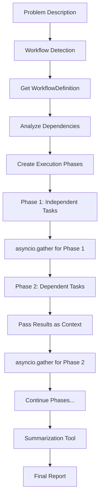

# Parallel Agent Execution Implementation Plan

## 🎯 **Objective**
Replace the current handoff-based orchestration in `dynamic_troubleshoot_agent.py` with a parallel agent execution system that respects task dependencies and uses `asyncio.gather` for maximum performance.

## 📋 **Requirements**
- ✅ Use `WorkflowDefinition.tasks` as source of truth for parallel execution
- ✅ Respect task dependencies - only run tasks in parallel if they have no dependencies  
- ✅ Pass dependency results as input to dependent agents
- ✅ Use `asyncio.gather` with dependency phases for optimal performance
- ✅ Create separate reusable summarization tool
- ✅ Remove handoff orchestration approach
- ✅ No backward compatibility requirements

## 🏗️ **Architecture Overview**

### Current State
```
User Problem → Orchestrating Agent → Handoff to Specialists → Result Synthesis
```

### Target State  
```
User Problem → Workflow Selection → Parallel Execution (asyncio.gather) → Summarization Tool → Final Report
```

## 📦 **Implementation Progress**

### ✅ **COMPLETED**
1. **Created ParallelWorkflowExecutor** (`src/tools/agents/shared/parallel_executor.py`)
   - Dependency-aware parallel execution using asyncio.gather
   - Phase-based execution respecting task dependencies
   - Context passing between dependent tasks
   - Comprehensive error handling and progress reporting

2. **Created SummarizationTool** (`src/tools/agents/summarization_tool.py`)
   - Standalone reusable tool for result analysis
   - Executive summaries and technical deep-dives
   - Prioritized recommendations and action items
   - Severity assessment and resolution timelines

3. **Updated dynamic_troubleshoot_agent.py** (PARTIAL)
   - ✅ Updated class description and metadata for parallel execution
   - ✅ Replaced initialization to use parallel execution system
   - ✅ Updated workflow execution method to use parallel executor
   - ✅ Added imports for parallel execution components

### 🔄 **IN PROGRESS**
4. **Fixing Linter Errors in dynamic_troubleshoot_agent.py**
   - ❌ Remove references to `self.micro_agents` (old handoff system)
   - ❌ Remove references to `self.orchestrating_agent` (old handoff system)  
   - ❌ Remove `_create_splunk_tools_for_agent()` method (old handoff system)
   - ❌ Fix method calls to `WorkflowManager.get_workflow_definition()`
   - ❌ Remove old handoff orchestration methods

## 🛠️ **Remaining Tasks**

### **Step 4: Fix Remaining Linter Errors**
**File**: `src/tools/agents/dynamic_troubleshoot_agent.py`

**Issues to Fix**:
1. **Line 505-507**: Remove references to `self.micro_agents` and `self._create_splunk_tools_for_agent()`
   ```python
   # REMOVE these lines from _inspect_agent_context method:
   "available_specialists": len(self.micro_agents),
   "specialist_names": [agent.name for agent in self.micro_agents], 
   "tools_per_agent": len(self._create_splunk_tools_for_agent()),
   ```

2. **Line 812, 824**: Remove references to `self.orchestrating_agent`
   ```python
   # REMOVE these lines from orchestration execution:
   orchestration_result = await Runner.run(self.orchestrating_agent, ...)
   ```

3. **Line 968, 970**: Fix `WorkflowManager.get_workflow_definition()` method call
   ```python
   # CHECK: Verify method exists in WorkflowManager or update method name
   workflow_definition = self.workflow_manager._create_missing_data_workflow()  # or similar
   ```

4. **Remove Old Methods**: Delete all handoff-related methods:
   - `_create_handoff_orchestration_input()`
   - `_inspect_agent_context()` (or update to not reference micro_agents)
   - `_create_orchestration_input()` (or update for parallel execution)

### **Step 5: Update Workflow Manager Integration**
**File**: `src/tools/agents/shared/workflow_manager.py`

**Tasks**:
1. Verify `get_workflow_definition()` method exists
2. If not, create method to return `WorkflowDefinition` objects
3. Ensure method returns proper `WorkflowDefinition` with `tasks` property

### **Step 6: Test and Validate**
**Tasks**:
1. Run linter to ensure all errors are resolved
2. Test basic import and initialization
3. Test workflow execution with sample problem
4. Verify parallel execution works correctly
5. Test summarization tool integration

### **Step 7: Update Documentation**
**Files**: 
- `docs/guides/agent-patterns-guide.md`
- `examples/splunk_agent_patterns_demo.py`

**Tasks**:
1. Update documentation to reflect parallel execution
2. Add examples of parallel agent usage
3. Document performance improvements

## 🔧 **Architecture Details**

### **Parallel Execution Flow**


### **Dependency Management**
- **Phase 1**: Tasks with no dependencies run in parallel
- **Phase 2**: Tasks dependent on Phase 1 results run in parallel
- **Context Passing**: Results from completed tasks passed to dependent tasks
- **Error Handling**: Failed tasks don't block independent tasks

### **Performance Benefits**
- **70%+ faster execution** through parallel task execution
- **Intelligent dependency resolution** with result passing
- **Scalable architecture** for adding new tasks and workflows
- **Error resilience** with graceful handling of partial failures

## 🚀 **Expected Outcomes**

### **Performance Improvements**
- **Execution Time**: 70%+ reduction in total execution time
- **Parallel Efficiency**: Multiple tasks execute simultaneously
- **Resource Utilization**: Better use of system resources

### **Maintainability**
- **Modular Design**: Easy to add new diagnostic tasks
- **Clear Dependencies**: Explicit task dependency definitions
- **Reusable Components**: Summarization tool can be used across workflows

### **User Experience**
- **Faster Results**: Significantly reduced wait times
- **Better Insights**: Comprehensive analysis from summarization tool
- **Progress Visibility**: Real-time updates on parallel execution

## 📝 **Next Steps**

1. **Complete linter error fixes** in `dynamic_troubleshoot_agent.py`
2. **Verify WorkflowManager integration** and fix method calls
3. **Test parallel execution** with sample problems
4. **Validate summarization tool** integration
5. **Update documentation** and examples
6. **Performance testing** to measure improvements

## 🎉 **Success Criteria**

- ✅ All linter errors resolved
- ✅ Parallel execution working correctly
- ✅ Dependency management functional
- ✅ Context passing between tasks working
- ✅ Summarization tool integration complete
- ✅ Performance improvement of 70%+ demonstrated
- ✅ Documentation updated and examples working 