# 🤖 AI-Powered Splunk Troubleshooting: Agents as Tools

> **Transform your Splunk troubleshooting from reactive firefighting to intelligent, systematic problem-solving with AI-powered workflows and specialist agents.**

## 🚀 Revolutionary Approach to Splunk Operations

The MCP Server for Splunk doesn't just provide tools—it provides **intelligent AI agents** that work like your best Splunk experts, available 24/7 to diagnose issues, analyze performance, and guide you through complex troubleshooting scenarios.

### 💡 **What Makes This Different?**

Instead of memorizing dozens of SPL queries and troubleshooting procedures, you now have:

- **🧠 AI Specialists** that understand Splunk's architecture and common issues
- **🔄 Automated Workflows** that follow proven troubleshooting methodologies  
- **⚡ Parallel Execution** that runs multiple diagnostic checks simultaneously
- **📊 Intelligent Summarization** that provides executive-level insights
- **🎯 Contextual Analysis** that adapts to your specific environment

---

## 🏗️ **The Agent Architecture**

### **Dynamic Troubleshoot Agent**
Your primary AI troubleshooting partner that intelligently routes problems to specialized workflows.

```python
# Instead of this manual approach:
# 1. Check server health
# 2. Verify data ingestion  
# 3. Analyze search performance
# 4. Review indexer status
# 5. Check forwarder connectivity
# 6. Examine license usage
# 7. Validate user permissions
# 8. Generate recommendations

# You simply do this:
await dynamic_troubleshoot_agent.execute(
    problem_description="Dashboard shows no data for the last 2 hours",
    workflow_type="missing_data_troubleshooting"
)
```

### **Specialist Workflows**
Pre-built AI workflows that embody years of Splunk expertise:

#### 🔍 **Missing Data Troubleshooting**
Follows Splunk's official 10-step missing data checklist:
- License and edition verification
- Index configuration validation  
- Permissions and RBAC analysis
- Time range and timestamp verification
- Forwarder connectivity checks
- Search head configuration review
- License violation detection
- Scheduled search analysis
- Field extraction troubleshooting

#### ⚡ **Performance Analysis**
Comprehensive system performance diagnostics:
- Resource utilization analysis (CPU, memory, disk)
- Search concurrency and performance monitoring
- Indexing pipeline bottleneck detection
- Queue analysis and processing delays
- KV Store and search head performance
- Network and forwarder performance analysis

---

## 🎯 **Workflow-Driven Intelligence**

### **Parallel Execution Engine**
Our workflows don't run tasks sequentially—they execute in **intelligent parallel phases** based on dependencies:

```
Phase 1 (Parallel):     Phase 2 (Depends on Phase 1):     Phase 3 (Final Analysis):
├── Server Health       ├── Index Analysis                 ├── Root Cause Analysis
├── User Permissions    ├── Data Quality Check             ├── Recommendations  
├── License Check       ├── Performance Metrics            └── Executive Summary
└── Basic Connectivity  └── Configuration Review
```

**Result**: 3-5x faster troubleshooting compared to sequential approaches.

### **Smart Tool Selection**
Each workflow automatically selects the right tools for the job:

| **Tool Category** | **Purpose** | **Examples** |
|------------------|-------------|--------------|
| **Search Tools** | Data analysis and investigation | `run_splunk_search`, `run_oneshot_search` |
| **Metadata Tools** | Environment discovery | `list_splunk_indexes`, `list_splunk_sources` |
| **Admin Tools** | Configuration and health checks | `get_splunk_health`, `get_configurations` |
| **Alert Tools** | Alert status and troubleshooting | `list_triggered_alerts`, `get_alert_status` |
| **KV Store Tools** | Lookup data management | `get_kvstore_data`, `list_kvstore_collections` |

---

## 🛠️ **Workflow Management Suite**

### **Build Your Own AI Agents** 🤖

Transform your organization's troubleshooting expertise into intelligent AI workflows that anyone can execute. Our comprehensive workflow building system lets you create custom agents that embody your team's knowledge and procedures.

#### **🎯 Complete Workflow Development Lifecycle**

The diagram below shows how you can build, validate, and deploy your own AI troubleshooting agents:

```mermaid
graph TD
    A[👤 User Wants Custom AI Agent] --> B{Know Requirements?}
    
    B -->|No| C[🔍 WorkflowRequirementsTool]
    B -->|Yes| D[🛠️ WorkflowBuilderTool]
    
    C --> C1[📋 Get Schema & Available Tools]
    C --> C2[📖 Review Context Variables]
    C --> C3[💡 See Best Practices & Examples]
    C1 --> D
    C2 --> D
    C3 --> D
    
    D --> D1{Creation Mode}
    D1 -->|New Workflow| D2[🆕 Create Mode]
    D1 -->|Edit Existing| D3[✏️ Edit Mode]
    D1 -->|Use Template| D4[📝 Template Mode]
    D1 -->|Validate Only| D5[✅ Validate Mode]
    D1 -->|Process Finished| D6[⚙️ Process Mode]
    
    D2 --> E[🎯 Interactive Creation]
    D3 --> E
    D4 --> E
    D5 --> F[📊 Validation Results]
    D6 --> F
    
    E --> E1[📝 Define Workflow Metadata]
    E --> E2[🔧 Create Tasks with Tools]
    E --> E3[🔗 Set Dependencies]
    E --> E4[📋 Add Instructions]
    
    E1 --> G[🔍 Comprehensive Validation]
    E2 --> G
    E3 --> G
    E4 --> G
    
    G --> G1[✅ Schema Compliance]
    G --> G2[🛠️ Tool Availability Check]
    G --> G3[🔄 Dependency Analysis]
    G --> G4[🎯 Context Variable Validation]
    G --> G5[🔌 Integration Compatibility]
    
    G1 --> H{Validation Passed?}
    G2 --> H
    G3 --> H
    G4 --> H
    G5 --> H
    
    H -->|❌ Failed| I[🚨 Error Report & Fixes]
    H -->|✅ Passed| J[💾 Save Workflow Definition]
    
    I --> D
    J --> K[🚀 Ready for Execution]
    
    K --> L[🎯 Choose Execution Method]
    L --> L1[🤖 Dynamic Troubleshoot Agent<br/>Auto-selects workflow]
    L --> L2[⚡ Workflow Runner Tool<br/>Direct execution by ID]
    L --> L3[🔧 Agent Troubleshoot<br/>Specialist routing]
    
    L1 --> M[🧠 AI Triage Analysis]
    M --> N[📋 Workflow Selection]
    N --> O[⚡ Parallel Execution]
    
    L2 --> O
    L3 --> P[🎯 Specialist Agent Routing]
    P --> O
    
    O --> O1[📊 Task Execution with Progress]
    O --> O2[🔄 Dependency Management]
    O --> O3[⚡ 3-5x Parallel Speed-up]
    
    O1 --> Q[📈 Results Collection]
    O2 --> Q
    O3 --> Q
    
    Q --> R[🤖 AI-Powered Summarization]
    R --> S[📋 Executive Summary]
    R --> T[🔧 Technical Details]
    R --> U[📝 Next Steps & Recommendations]
    
    S --> V[✨ Intelligent Splunk Expert Available 24/7]
    T --> V
    U --> V
    
    style A fill:#e1f5fe
    style V fill:#e8f5e8
    style C fill:#fff3e0
    style D fill:#f3e5f5
    style O fill:#e3f2fd
    style R fill:#e8f5e8
```



### **Workflow Builder** 🏗️
Create custom troubleshooting procedures that integrate seamlessly with the AI system:

```python
# Create workflows that match your organization's procedures
custom_workflow = {
    "workflow_id": "security_incident_response",
    "name": "Security Incident Response",
    "description": "Automated security incident analysis and response",
    "tasks": [
        {
            "task_id": "threat_detection",
            "name": "Threat Detection Analysis",
            "instructions": "Analyze authentication failures and suspicious activities...",
            "required_tools": ["run_splunk_search"],
            "context_requirements": ["focus_index", "earliest_time", "latest_time"]
        }
    ]
}

# Validate and process the workflow
result = await workflow_builder.execute(
    mode="process",
    workflow_data=custom_workflow
)
```

### **Workflow Runner** ⚡
Execute any workflow with full parameter control:

```python
# Run workflows with specific context
await workflow_runner.execute(
    workflow_id="performance_analysis",
    problem_description="Searches running slowly on indexer-03",
    focus_host="indexer-03",
    complexity_level="advanced",
    enable_summarization=True
)
```

### **Workflow Requirements** 📋
Comprehensive schema and validation system ensures workflow quality and compatibility.

---

## 🎯 **Available Workflow Building Tools**

### **1. WorkflowRequirementsTool** 📋
**Purpose**: Get comprehensive requirements and schema information for creating custom workflows.

```python
# Understand what you need to build workflows
requirements = await workflow_requirements.execute(format_type="detailed")

# Quick reference for experienced users  
quick_ref = await workflow_requirements.execute(format_type="quick")

# Get JSON schemas for validation
schemas = await workflow_requirements.execute(format_type="schema")

# See examples and patterns
examples = await workflow_requirements.execute(format_type="examples")
```

**What You Get**:
- 📖 Complete schema documentation (WorkflowDefinition, TaskDefinition)
- 🛠️ List of 50+ available Splunk tools with descriptions
- 🎯 Context variables and usage patterns
- ✅ Validation rules and constraints
- 🔌 Integration guidelines with dynamic troubleshoot agent
- 💡 Best practices for workflow design

### **2. WorkflowBuilderTool** 🏗️
**Purpose**: Interactive tool for creating, editing, and validating custom workflows.

#### **Creation Modes**:

**🆕 Create Mode** - Interactive workflow creation from scratch:
```python
# Start interactive creation process
result = await workflow_builder.execute(mode="create")
```

**📝 Template Mode** - Generate pre-built templates:
```python
# Generate security analysis template
security_template = await workflow_builder.execute(
    mode="template", 
    template_type="security"
)

# Available templates: minimal, security, performance, data_quality, parallel, sequential
```

**✏️ Edit Mode** - Modify existing workflows:
```python
# Edit existing workflow definition
result = await workflow_builder.execute(
    mode="edit",
    workflow_data=existing_workflow_json
)
```

**✅ Validate Mode** - Comprehensive validation:
```python
# Validate workflow structure and compatibility
validation = await workflow_builder.execute(
    mode="validate",
    workflow_data=my_workflow
)
```

**⚙️ Process Mode** - Handle finished workflows:
```python
# Process and validate complete workflow definitions
result = await workflow_builder.execute(
    mode="process",
    workflow_data={
        "workflow_id": "custom_security_analysis",
        "name": "Custom Security Analysis",
        "description": "Organization-specific security workflow",
        "tasks": [
            {
                "task_id": "threat_detection",
                "name": "Threat Detection Analysis", 
                "instructions": "Analyze authentication failures...",
                "required_tools": ["run_splunk_search"],
                "dependencies": []
            }
        ]
    }
)
```

#### **Validation Features**:
- ✅ **Schema Compliance**: Ensures workflow follows required structure
- 🛠️ **Tool Availability**: Verifies all required tools exist and are accessible
- 🔄 **Dependency Analysis**: Detects circular dependencies and validates task order
- 🎯 **Context Validation**: Checks context variable requirements and usage
- 🔌 **Integration Compatibility**: Ensures compatibility with workflow runner and dynamic agent

### **3. WorkflowRunnerTool** ⚡
**Purpose**: Execute any available workflow by ID with comprehensive parameter control.

```python
# Execute custom workflows directly
result = await workflow_runner.execute(
    workflow_id="custom_security_analysis",
    problem_description="Suspicious login activity detected",
    earliest_time="-24h",
    latest_time="now",
    focus_index="security",
    complexity_level="advanced",
    enable_summarization=True
)
```

**Key Features**:
- 🎯 **Universal Execution**: Run any workflow (core or custom) by ID
- ⚡ **Parallel Processing**: Dependency-aware parallel task execution
- 📊 **Progress Tracking**: Real-time progress reporting during execution
- 🤖 **AI Summarization**: Optional AI-powered result analysis
- 🔧 **Parameter Flexibility**: Full control over time ranges and focus areas

---

## 🚀 **Step-by-Step: Building Your First Custom Agent**

### **Step 1: Understand Requirements**
```python
# Get comprehensive requirements
requirements = await workflow_requirements.execute(format_type="detailed")
```

### **Step 2: Start with a Template**
```python
# Generate a template for your use case
template = await workflow_builder.execute(
    mode="template",
    template_type="security"  # or performance, data_quality, etc.
)
```

### **Step 3: Customize Your Workflow**
```python
# Create your custom workflow
custom_workflow = {
    "workflow_id": "compliance_audit",
    "name": "SOX Compliance Audit",
    "description": "Automated SOX compliance verification workflow",
    "tasks": [
        {
            "task_id": "audit_trail_check",
            "name": "Audit Trail Verification",
            "instructions": "Verify audit trail completeness for the specified time period. Search for: index=audit earliest={earliest_time} latest={latest_time} | stats count by user, action | where count > threshold",
            "required_tools": ["run_splunk_search"],
            "dependencies": [],
            "context_requirements": ["earliest_time", "latest_time"]
        },
        {
            "task_id": "access_review",
            "name": "Access Control Review", 
            "instructions": "Review user access patterns and identify anomalies",
            "required_tools": ["run_splunk_search", "list_users"],
            "dependencies": ["audit_trail_check"]
        }
    ]
}
```

### **Step 4: Validate Your Workflow**
```python
# Validate the workflow
validation = await workflow_builder.execute(
    mode="process",
    workflow_data=custom_workflow
)
```

### **Step 5: Execute Your Custom Agent**
```python
# Run your custom workflow
result = await workflow_runner.execute(
    workflow_id="compliance_audit",
    problem_description="Monthly SOX compliance audit",
    earliest_time="-30d@d",
    latest_time="@d",
    complexity_level="advanced"
)
```

---

## 💡 **Advanced Workflow Patterns**

### **Parallel Task Execution**
```python
{
    "tasks": [
        {
            "task_id": "health_check",
            "dependencies": []  # Runs in Phase 1
        },
        {
            "task_id": "performance_check", 
            "dependencies": []  # Runs in Phase 1 (parallel)
        },
        {
            "task_id": "analysis",
            "dependencies": ["health_check", "performance_check"]  # Runs in Phase 2
        }
    ]
}
```

### **Context-Aware Instructions**
```python
{
    "task_id": "focused_search",
    "instructions": "Search for errors in {focus_index} from {earliest_time} to {latest_time}. If focus_host is provided, filter by host={focus_host}",
    "context_requirements": ["focus_index", "earliest_time", "latest_time"],
    "optional_context": ["focus_host"]
}
```

### **Multi-Tool Task Execution**
```python
{
    "task_id": "comprehensive_analysis",
    "required_tools": [
        "run_splunk_search",      # For data analysis
        "get_configurations",     # For config review
        "get_splunk_health",      # For health check
        "list_triggered_alerts"   # For alert analysis
    ]
}
```

---

## 🎪 **Real-World Usage Scenarios**

### **Scenario 1: Data Visibility Crisis**
**Problem**: "Critical dashboard shows no data since midnight"

**Traditional Approach** (30-60 minutes):
1. Manually check each component
2. Run multiple searches to investigate
3. Check configurations across multiple systems
4. Correlate findings manually
5. Generate action plan

**AI-Powered Approach** (5-10 minutes):
```python
result = await dynamic_troubleshoot_agent.execute(
    problem_description="Critical dashboard shows no data since midnight",
    workflow_type="missing_data_troubleshooting",
    focus_index="production",
    earliest_time="@d"
)
```

**AI delivers**:
- ✅ Systematic 10-step analysis
- ✅ Parallel execution of all checks
- ✅ Root cause identification
- ✅ Specific remediation steps
- ✅ Executive summary for stakeholders

### **Scenario 2: Performance Degradation**
**Problem**: "Search performance degraded 40% since yesterday"

```python
result = await workflow_runner.execute(
    workflow_id="performance_analysis",
    problem_description="Search performance degraded 40% since yesterday",
    earliest_time="-48h",
    complexity_level="advanced"
)
```

**AI provides**:
- 📊 Resource utilization trends
- 🔍 Bottleneck identification
- ⚡ Performance optimization recommendations
- 📈 Capacity planning insights

### **Scenario 3: Custom Compliance Workflow**
**Problem**: Need automated SOX compliance checking

```python
# Create custom compliance workflow
compliance_workflow = {
    "workflow_id": "sox_compliance_check",
    "name": "SOX Compliance Verification",
    "tasks": [
        {
            "task_id": "audit_trail_verification",
            "instructions": "Verify audit trail completeness for {compliance_framework}...",
            "required_tools": ["run_splunk_search", "get_configurations"]
        }
    ],
    "default_context": {
        "compliance_framework": "SOX",
        "retention_period": "2555"  # 7 years in days
    }
}
```

---

## 📈 **Measurable Business Impact**

### **Operational Efficiency**
- **🕐 90% reduction** in time-to-resolution for common issues
- **⚡ 3-5x faster** parallel diagnostic execution
- **🎯 100% consistency** in troubleshooting procedures
- **📚 Zero knowledge dependency** on individual experts

### **Cost Optimization**
- **💰 Reduced escalations** to senior engineers
- **🕒 Faster incident resolution** = less downtime cost
- **📖 Self-documenting** troubleshooting procedures
- **🔄 Reusable workflows** across teams and environments

### **Quality Assurance**
- **✅ Systematic approach** prevents missed steps
- **📊 Comprehensive analysis** covers all relevant areas
- **🧠 AI-powered insights** identify non-obvious correlations
- **📝 Audit trail** of all diagnostic steps

---

## 🚀 **Getting Started with AI Workflows**

### **1. Explore Available Workflows**
```python
# Discover what's available
workflows = await list_workflows.execute(format_type="detailed")
```

### **2. Run Your First AI Troubleshooting Session**
```python
# Start with missing data analysis
result = await dynamic_troubleshoot_agent.execute(
    problem_description="Describe your specific issue here",
    workflow_type="missing_data_troubleshooting",
    complexity_level="moderate"
)
```

### **3. Create Custom Workflows**
```python
# Build workflows that match your procedures
workflow_builder.execute(mode="create")
```

### **4. Scale Across Your Organization**
- Share workflows across teams
- Build organization-specific troubleshooting procedures
- Create compliance and audit workflows
- Develop performance optimization routines

---

## 🌟 **Why Choose AI-Powered Troubleshooting?**

### **For Splunk Administrators**
- **🎯 Consistent results** regardless of experience level
- **📚 Built-in best practices** from Splunk documentation
- **⚡ Faster problem resolution** with parallel execution
- **🔍 Comprehensive analysis** that doesn't miss edge cases

### **For DevOps Teams**
- **🤖 Automated diagnostics** that integrate with CI/CD
- **📊 Performance monitoring** with actionable insights
- **🔄 Repeatable procedures** for consistent operations
- **📈 Scalable troubleshooting** across environments

### **For Security Teams**
- **🛡️ Systematic threat analysis** with security-focused workflows
- **⚡ Rapid incident response** with automated data gathering
- **📋 Compliance verification** with audit-ready documentation
- **🔍 Deep forensic analysis** capabilities

### **For Management**
- **💰 Reduced operational costs** through automation
- **📊 Executive summaries** with business impact analysis
- **⏱️ Faster incident resolution** = less downtime
- **📈 Improved team productivity** and knowledge sharing

---

## 🔮 **The Future of Splunk Operations**

This isn't just about tools—it's about **transforming how you interact with Splunk**:

- **From reactive** → **proactive** operations
- **From manual** → **automated** diagnostics  
- **From individual expertise** → **organizational intelligence**
- **From fragmented tools** → **unified AI platform**

### **Extensible Architecture**
- 🔧 **Custom workflow creation** for any use case
- 🔌 **Plugin architecture** for new tools and integrations
- 🌐 **Community contributions** through the contrib/ system
- 🚀 **Continuous evolution** with new AI capabilities

---

## 📞 **Ready to Transform Your Splunk Operations?**

### **Quick Start**
1. **Install** the MCP Server for Splunk
2. **Connect** through your favorite MCP client (Cursor, Claude Desktop, etc.)
3. **Run** your first AI workflow: `mcp_splunk_dynamic_troubleshoot`
4. **Experience** the difference intelligent automation makes

### **Advanced Usage**
- Create custom workflows for your specific environment
- Build compliance and audit procedures
- Develop performance optimization routines
- Share workflows across your organization

### **Enterprise Support**
- Custom workflow development
- Integration with existing tools and processes
- Training and knowledge transfer
- Ongoing support and optimization

---

## 🏆 **Join the AI-Powered Splunk Revolution**

Don't let complex troubleshooting procedures slow down your team. Embrace the future of intelligent Splunk operations with AI agents that work as hard as your best engineers, 24/7.

**Your Splunk environment deserves intelligent automation. Your team deserves to focus on innovation, not repetitive troubleshooting.**

---

*Ready to see the difference? Try running a workflow and experience the power of AI-driven Splunk troubleshooting firsthand.* 