## Workflows Overview: AI-Powered Splunk Troubleshooting

> Use workflow tools to define, validate, discover, and execute JSON workflows. Legacy “dynamic agent” docs have been replaced by these tools.

### What are workflows?

Workflows are structured troubleshooting procedures that:
- Encode expert Splunk practices as JSON
- Run tasks in parallel phases for 3–5x speedups
- Adapt to your context via time window and focus parameters

### Prerequisites

- Set OpenAI env vars in `.env` (copy from `env.example`):

```bash
OPENAI_API_KEY=your_openai_api_key_here
OPENAI_MODEL=gpt-4o
OPENAI_TEMPERATURE=0.7
OPENAI_MAX_TOKENS=4000
```

- Ensure OpenAI dependencies are available:

```bash
uv add openai
uv add openai-agents
```

### Lifecycle

```mermaid
graph LR
    A[📋 workflow_requirements] --> B[🛠️ workflow_builder]
    B --> C[✅ validate/process]
    C --> D[🚀 workflow_runner]
    D --> E[📊 Results]

    A -->|discover| F[📚 list_workflows]

    style A fill:#fff3e0
    style B fill:#f3e5f5
    style C fill:#e8f5e8
    style D fill:#e3f2fd
    style E fill:#e8f5e8
    style F fill:#e3f2fd
```



### Tools

- `workflow_requirements`: schema, validation rules, best practices
- `workflow_builder`: create/edit/validate/process workflows, generate templates
- `list_workflows`: discover core and contrib workflow IDs
- `workflow_runner`: execute a workflow by ID with context and summarization

### Quick start

```python
from src.tools.workflows.list_workflows import create_list_workflows_tool
from src.tools.workflows.workflow_runner import WorkflowRunnerTool

# Discover
lister = create_list_workflows_tool()
await lister.execute(ctx, format_type="summary")

# Run core performance analysis
runner = WorkflowRunnerTool("workflow_runner", "workflows")
await runner.execute(
    ctx=ctx,
    workflow_id="performance_analysis",
    earliest_time="-24h",
    latest_time="now",
    complexity_level="moderate",
)
```

### Core workflows

- `missing_data_troubleshooting`: Systematic, 10-step missing data analysis based on Splunk guidance. Background reference: “Troubleshoot inputs with metrics.log” (`https://help.splunk.com/en/splunk-enterprise/administer/troubleshoot/10.0/splunk-enterprise-log-files/troubleshoot-inputs-with-metrics.log`).
- `performance_analysis`: Resource and search performance diagnostics.

### Benefits

- **Consistency**: Encodes best-practice procedures
- **Speed**: Parallel phases accelerate diagnostics
- **Coverage**: Reduces human error and missed steps
- **Automation**: Reuse for routine tasks with rich summaries

### Where workflows live

- Core: `src/tools/workflows/core/`
- Contrib: `contrib/workflows/<category>/<workflow_id>.json`

### See also

- `README.md` in this folder for a concise quick start
- `workflow_runner_guide.md` for detailed execution parameters and progress behavior
