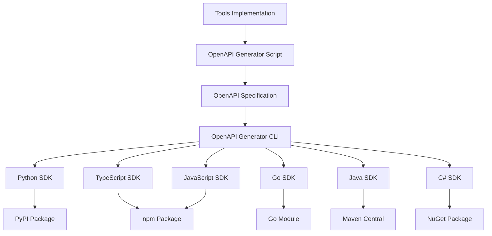

# Client SDK Development for MCP Server for Splunk

This document provides a comprehensive guide for developing, generating, and maintaining client SDKs for the MCP Server for Splunk.

## Overview

The MCP Server for Splunk provides a complete SDK generation framework that creates type-safe client libraries in multiple programming languages from a single OpenAPI 3.0 specification.

## Architecture

### OpenAPI-First Approach



### Generation Pipeline

1. **Source Analysis**: Extract tool metadata from source code
2. **Specification Generation**: Create OpenAPI 3.0 specification
3. **SDK Generation**: Generate language-specific client libraries
4. **Documentation Generation**: Create comprehensive documentation
5. **Testing**: Automated testing for all generated SDKs
6. **Publishing**: Automated publishing to package managers

## Getting Started

### Prerequisites

- **Python 3.8+**: For the generation scripts
- **Node.js 18+**: For OpenAPI Generator CLI
- **Java 17+**: Required by OpenAPI Generator
- **Git**: For version control

### Installation

```bash
# Install OpenAPI Generator CLI
npm install -g @openapitools/openapi-generator-cli

# Install Java (if not available)
brew install openjdk@17
export PATH="/opt/homebrew/opt/openjdk@17/bin:$PATH"

# Clone the repository
git clone https://github.com/your-org/mcp-server-for-splunk.git
cd mcp-server-for-splunk
```

### Basic Usage

```bash
# Generate all SDKs
python scripts/generate_client_sdks.py

# Generate specific language SDKs
python scripts/generate_client_sdks.py --languages python typescript

# Custom output directory
python scripts/generate_client_sdks.py --output ./custom-sdk-dir
```

## SDK Configuration

Each language SDK has specific configuration options:

### Python SDK

```yaml
generator: python
package_name: splunk_mcp_client
additional_properties:
  packageName: splunk_mcp_client
  projectName: splunk-mcp-client
  packageVersion: 1.0.0
  packageDescription: Python client SDK for MCP Server for Splunk
  packageAuthor: MCP Server for Splunk Team
  packageUrl: https://github.com/your-org/mcp-server-for-splunk
```

### TypeScript SDK

```yaml
generator: typescript-fetch
package_name: splunk-mcp-client
additional_properties:
  npmName: splunk-mcp-client
  npmVersion: 1.0.0
  npmDescription: TypeScript client SDK for MCP Server for Splunk
  npmRepository: https://github.com/your-org/mcp-server-for-splunk
  supportsES6: true
  withInterfaces: true
```

### Go SDK

```yaml
generator: go
package_name: splunkmcpclient
additional_properties:
  packageName: splunkmcpclient
  packageVersion: 1.0.0
  packageUrl: github.com/your-org/mcp-server-for-splunk/sdk/go
```

## Development Workflow

### 1. Update OpenAPI Specification

When adding new tools or modifying existing ones:

```bash
# Regenerate OpenAPI spec
python scripts/generate_api_docs.py

# Verify the specification
python scripts/validate_openapi_spec.py
```

### 2. Generate SDKs

```bash
# Generate all SDKs
python scripts/generate_client_sdks.py

# Or generate specific ones
python scripts/generate_client_sdks.py --languages python typescript
```

### 3. Test Generated SDKs

```bash
# Test Python SDK
cd sdk/client-python
pip install -e .
python -m pytest tests/

# Test TypeScript SDK
cd sdk/client-typescript
npm install
npm test

# Test Go SDK
cd sdk/client-go
go mod tidy
go test ./...
```

### 4. Update Documentation

```bash
# Generate language-specific documentation
python scripts/generate_sdk_docs.py

# Update examples
python scripts/generate_examples.py
```

## SDK Structure

Each generated SDK follows a consistent structure:

```
client-{language}/
├── api/                 # Generated API client classes
│   ├── default_api.py  # Main API interface
│   └── ...
├── models/             # Generated data models
│   ├── tool_call_request.py
│   ├── tool_call_response.py
│   └── ...
├── docs/               # Generated documentation
│   ├── README.md       # Language-specific guide
│   ├── EXAMPLES.md     # Usage examples
│   └── api/            # API documentation
├── examples/           # Example applications
│   ├── basic_usage.py
│   ├── advanced_integration.py
│   └── ...
├── tests/              # Unit tests
│   ├── test_api.py
│   └── ...
├── setup.py           # Package configuration (Python)
├── package.json       # Package configuration (Node.js)
├── go.mod             # Module configuration (Go)
└── README.md          # Generated README
```

## Language-Specific Implementation

### Python SDK

**Features:**
- Type hints for all APIs
- Async/await support
- Comprehensive error handling
- Request/response logging
- Connection pooling

**Example:**
```python
from splunk_mcp_client import McpClient
from splunk_mcp_client.configuration import Configuration

config = Configuration(host="http://localhost:8001/mcp")
client = McpClient(configuration=config)

# Health check
health = client.tools_api.tools_call_post({
    "jsonrpc": "2.0",
    "method": "tools/call",
    "params": {
        "name": "get_splunk_health",
        "arguments": {}
    },
    "id": "1"
})
```

### TypeScript SDK

**Features:**
- Full TypeScript type definitions
- Modern ES6+ support
- Promise-based APIs
- Fetch API integration
- Node.js and browser compatibility

**Example:**
```typescript
import { Configuration, ToolsApi } from 'splunk-mcp-client';

const config = new Configuration({
    basePath: 'http://localhost:8001/mcp'
});
const toolsApi = new ToolsApi(config);

const health = await toolsApi.toolsCallPost({
    jsonrpc: "2.0",
    method: "tools/call",
    params: {
        name: "get_splunk_health",
        arguments: {}
    },
    id: "1"
});
```

### Go SDK

**Features:**
- Idiomatic Go APIs
- Context support
- Structured error handling
- HTTP client customization
- Comprehensive documentation

**Example:**
```go
package main

import (
    "context"
    "github.com/your-org/mcp-server-for-splunk/sdk/go"
)

func main() {
    config := splunkmcpclient.NewConfiguration()
    config.Servers[0].URL = "http://localhost:8001/mcp"
    
    client := splunkmcpclient.NewAPIClient(config)
    
    request := splunkmcpclient.ToolCallRequest{
        Jsonrpc: "2.0",
        Method:  "tools/call",
        Params: splunkmcpclient.ToolCallRequestParams{
            Name:      "get_splunk_health",
            Arguments: map[string]interface{}{},
        },
        Id: splunkmcpclient.PtrString("1"),
    }
    
    result, _, err := client.DefaultApi.ToolsCallPost(context.Background()).
        ToolCallRequest(request).Execute()
}
```

## Testing Framework

### Unit Testing

Each SDK includes comprehensive unit tests:

```python
# Python example
import unittest
from unittest.mock import Mock, patch
from splunk_mcp_client import McpClient

class TestSplunkMCPClient(unittest.TestCase):
    def setUp(self):
        self.client = McpClient(host="http://localhost:8001/mcp")
    
    @patch('splunk_mcp_client.api.default_api.DefaultApi.tools_call_post')
    def test_health_check(self, mock_call):
        # Test implementation
        pass
```

### Integration Testing

```python
# Integration tests against live server
import pytest
from splunk_mcp_client import McpClient

@pytest.fixture
def client():
    return McpClient(host=os.getenv('MCP_HOST', 'http://localhost:8001/mcp'))

def test_health_check_integration(client):
    result = client.tools_api.tools_call_post({
        "jsonrpc": "2.0",
        "method": "tools/call",
        "params": {"name": "get_splunk_health", "arguments": {}},
        "id": "test"
    })
    
    assert not result.result.is_error
    assert "status" in result.result.content[0].text
```

### Performance Testing

```python
# Performance benchmarks
import time
import concurrent.futures
from splunk_mcp_client import McpClient

def benchmark_concurrent_calls():
    client = McpClient(host="http://localhost:8001/mcp")
    
    def make_call():
        return client.tools_api.tools_call_post({
            "jsonrpc": "2.0",
            "method": "tools/call",
            "params": {"name": "get_splunk_health", "arguments": {}},
            "id": str(time.time())
        })
    
    with concurrent.futures.ThreadPoolExecutor(max_workers=10) as executor:
        futures = [executor.submit(make_call) for _ in range(100)]
        results = [f.result() for f in futures]
    
    return len([r for r in results if not r.result.is_error])
```

## Publishing & Distribution

### Automated Publishing

Each SDK is automatically published to its respective package manager:

```yaml
# GitHub Actions workflow
name: Publish SDKs
on:
  release:
    types: [published]

jobs:
  publish-python:
    runs-on: ubuntu-latest
    steps:
      - uses: actions/checkout@v3
      - name: Set up Python
        uses: actions/setup-python@v3
        with:
          python-version: '3.8'
      - name: Install dependencies
        run: |
          pip install build twine
      - name: Build package
        run: |
          cd sdk/client-python
          python -m build
      - name: Publish to PyPI
        env:
          TWINE_USERNAME: __token__
          TWINE_PASSWORD: ${{ secrets.PYPI_API_TOKEN }}
        run: |
          cd sdk/client-python
          twine upload dist/*
```

### Version Management

SDKs follow semantic versioning:

```json
{
  "version": "1.2.3",
  "compatibility": {
    "mcp_server": ">=1.2.0",
    "openapi_spec": "3.0.0"
  }
}
```

### Package Metadata

Each package includes comprehensive metadata:

```python
# Python setup.py
setup(
    name="splunk-mcp-client",
    version="1.0.0",
    description="Python client SDK for MCP Server for Splunk",
    long_description=long_description,
    long_description_content_type="text/markdown",
    author="MCP Server for Splunk Team",
    author_email="support@your-org.com",
    url="https://github.com/your-org/mcp-server-for-splunk",
    packages=find_packages(exclude=["tests*"]),
    install_requires=[
        "urllib3>=1.26.0",
        "requests>=2.25.0",
        "python-dateutil>=2.8.0"
    ],
    python_requires=">=3.8",
    classifiers=[
        "Development Status :: 4 - Beta",
        "Intended Audience :: Developers",
        "License :: OSI Approved :: MIT License",
        "Programming Language :: Python :: 3",
        "Programming Language :: Python :: 3.8",
        "Programming Language :: Python :: 3.9",
        "Programming Language :: Python :: 3.10",
        "Programming Language :: Python :: 3.11",
    ],
)
```

## Advanced Features

### Custom Templates

For specialized SDK requirements, custom templates can be used:

```bash
# Generate with custom templates
python scripts/generate_client_sdks.py \
  --template-dir ./templates/python-async \
  --languages python
```

### SDK Extensions

Each SDK can be extended with additional functionality:

```python
# Python SDK extension
class ExtendedSplunkClient(McpClient):
    def __init__(self, *args, **kwargs):
        super().__init__(*args, **kwargs)
        self.retry_count = 3
        self.timeout = 30
    
    def robust_health_check(self):
        for attempt in range(self.retry_count):
            try:
                return self.tools_api.tools_call_post({
                    "jsonrpc": "2.0",
                    "method": "tools/call",
                    "params": {"name": "get_splunk_health", "arguments": {}},
                    "id": f"health_{attempt}"
                })
            except Exception as e:
                if attempt == self.retry_count - 1:
                    raise
                time.sleep(2 ** attempt)
```

### Plugin System

SDKs support plugins for additional functionality:

```python
# Plugin interface
class SplunkMCPPlugin:
    def before_request(self, request):
        """Called before each API request"""
        pass
    
    def after_response(self, response):
        """Called after each API response"""
        pass
    
    def on_error(self, error):
        """Called when an error occurs"""
        pass

# Usage
client = McpClient(host="http://localhost:8001/mcp")
client.add_plugin(LoggingPlugin())
client.add_plugin(MetricsPlugin())
```

## Troubleshooting

### Common Issues

#### Java Not Found
```bash
# Install Java
brew install openjdk@17
export PATH="/opt/homebrew/opt/openjdk@17/bin:$PATH"
```

#### OpenAPI Generator Errors
```bash
# Update OpenAPI Generator
npm update -g @openapitools/openapi-generator-cli

# Clear cache
rm -rf ~/.npm/_npx
```

#### SDK Import Errors
```bash
# Python: Reinstall in development mode
cd sdk/client-python
pip uninstall splunk-mcp-client
pip install -e .

# TypeScript: Rebuild
cd sdk/client-typescript
rm -rf node_modules package-lock.json
npm install
```

### Debug Mode

Enable debug mode for troubleshooting:

```python
# Python SDK debug mode
import logging
logging.basicConfig(level=logging.DEBUG)

config = Configuration(
    host="http://localhost:8001/mcp",
    debug=True
)
client = McpClient(configuration=config)
```

### Performance Optimization

```python
# Connection pooling
config = Configuration(
    host="http://localhost:8001/mcp",
    connection_pool_maxsize=50,
    timeout=30
)

# Async client for high-throughput scenarios
import asyncio
from splunk_mcp_client.async_client import AsyncMcpClient

async def main():
    async with AsyncMcpClient(host="http://localhost:8001/mcp") as client:
        tasks = [client.get_health() for _ in range(100)]
        results = await asyncio.gather(*tasks)
    return results
```

## Contributing

### Adding New Languages

To add support for a new programming language:

1. **Update Generator Configuration**:
```python
# In scripts/generate_client_sdks.py
"rust": {
    "generator": "rust",
    "package_name": "splunk-mcp-client",
    "project_name": "Splunk MCP Client Rust",
    "additional_properties": {
        "packageName": "splunk_mcp_client",
        "packageVersion": "1.0.0",
        "packageDescription": "Rust client SDK for MCP Server for Splunk",
    }
}
```

2. **Create Documentation Template**:
```bash
mkdir -p docs/sdk/rust
touch docs/sdk/rust/README.md
```

3. **Add Testing Configuration**:
```yaml
# In .github/workflows/test-sdks.yml
test-rust:
  runs-on: ubuntu-latest
  steps:
    - uses: actions/checkout@v3
    - name: Install Rust
      uses: actions-rs/toolchain@v1
      with:
        toolchain: stable
    - name: Test Rust SDK
      run: |
        cd sdk/client-rust
        cargo test
```

### Custom Generator Templates

Create custom templates for specialized requirements:

```bash
# Create template directory
mkdir -p templates/python-async

# Copy base templates
cp -r ~/.openapi-generator/templates/python/* templates/python-async/

# Customize templates
# Edit templates/python-async/api.mustache
# Add async/await support, custom error handling, etc.
```

## Security Considerations

### Authentication

SDKs support multiple authentication methods:

```python
# API Key authentication
config = Configuration(
    host="http://localhost:8001/mcp",
    api_key={'X-API-Key': 'your-api-key'}
)

# Bearer token authentication
config = Configuration(
    host="http://localhost:8001/mcp",
    access_token='your-bearer-token'
)

# Custom authentication
class CustomAuth:
    def __call__(self, request):
        request.headers['Authorization'] = f'Custom {self.get_token()}'
        return request

config = Configuration(
    host="http://localhost:8001/mcp",
    auth=CustomAuth()
)
```

### SSL/TLS Configuration

```python
# Custom SSL configuration
config = Configuration(
    host="https://secure.example.com:8001/mcp",
    verify_ssl=True,
    ssl_ca_cert="/path/to/ca.pem",
    cert_file="/path/to/client.pem",
    key_file="/path/to/client.key"
)
```

### Input Validation

SDKs automatically validate inputs:

```python
# Schema validation
try:
    result = client.tools_api.tools_call_post({
        "jsonrpc": "2.0",
        "method": "tools/call",
        "params": {
            "name": "invalid_tool_name",  # Will be validated
            "arguments": {}
        },
        "id": "1"
    })
except ValidationError as e:
    print(f"Invalid input: {e}")
```

## Performance & Scalability

### Connection Pooling

```python
# Configure connection pooling
config = Configuration(
    host="http://localhost:8001/mcp",
    connection_pool_maxsize=100,
    maxsize=50,
    block=True
)
```

### Async Operations

```python
# Async client for high-performance scenarios
import asyncio
from splunk_mcp_client.async_client import AsyncMcpClient

async def parallel_health_checks(hosts):
    results = []
    
    async def check_host(host):
        async with AsyncMcpClient(host=host) as client:
            return await client.get_health()
    
    tasks = [check_host(host) for host in hosts]
    results = await asyncio.gather(*tasks, return_exceptions=True)
    
    return results
```

### Caching

```python
# Response caching
from functools import lru_cache
from splunk_mcp_client import McpClient

class CachedMcpClient(McpClient):
    @lru_cache(maxsize=128)
    def get_apps(self):
        return self.tools_api.tools_call_post({
            "jsonrpc": "2.0",
            "method": "tools/call",
            "params": {"name": "list_apps", "arguments": {}},
            "id": "cached_apps"
        })
```

## Future Roadmap

### Planned Features

- **GraphQL API Support**: Alternative to REST API
- **Real-time Subscriptions**: WebSocket-based real-time updates
- **SDK Analytics**: Usage metrics and performance monitoring
- **Code Generation Optimization**: Faster generation with incremental updates
- **Additional Language Support**: Rust, Swift, Kotlin, PHP

### Community Contributions

We welcome contributions to the SDK framework:

- New language generators
- Performance improvements
- Additional testing frameworks
- Documentation enhancements
- Example applications

## Resources

### Documentation
- [OpenAPI 3.0 Specification](https://swagger.io/specification/)
- [OpenAPI Generator Documentation](https://openapi-generator.tech/)
- [MCP Protocol Specification](https://modelcontextprotocol.io/)

### Tools
- [OpenAPI Generator CLI](https://github.com/OpenAPITools/openapi-generator-cli)
- [Swagger Editor](https://editor.swagger.io/)
- [Postman](https://www.postman.com/) for API testing

### Support
- [GitHub Issues](https://github.com/your-org/mcp-server-for-splunk/issues)
- [Discussions](https://github.com/your-org/mcp-server-for-splunk/discussions)
- [Documentation](https://docs.your-org.com/mcp-server-for-splunk)

---

*This document is part of the MCP Server for Splunk project. For the latest updates, please refer to the [official documentation](https://docs.your-org.com/mcp-server-for-splunk).* 