# 🤖 Workflows Overview: AI-Powered Splunk Troubleshooting

> **Quick introduction to the intelligent workflow system that transforms how you troubleshoot Splunk**

## What Are AI Workflows?

AI Workflows are **intelligent troubleshooting procedures** that combine:
- **Expert Knowledge**: Years of Splunk troubleshooting experience encoded as systematic procedures
- **AI Execution**: Intelligent agents that execute these procedures with human-like reasoning
- **Parallel Processing**: Multiple diagnostic checks running simultaneously for 3-5x faster results
- **Contextual Analysis**: Adapts to your specific Splunk environment and problem context

## Complete Workflow Development Lifecycle

```mermaid
graph LR
    A[📋 Get Requirements] --> B[🛠️ Build Workflow]
    B --> C[✅ Validate]
    C --> D[🚀 Execute]
    D --> E[📊 Results]

    A1[workflow_requirements] --> A
    B1[workflow_builder] --> B
    C1[validation system] --> C
    D1[workflow_runner] --> D
    D2[dynamic_troubleshoot_agent] --> D

    style A fill:#fff3e0
    style B fill:#f3e5f5
    style C fill:#e8f5e8
    style D fill:#e3f2fd
    style E fill:#e8f5e8
```



## Available Workflow Tools

### **🏗️ Build Your Own AI Agents**
| Tool | Purpose | Use Case |
|------|---------|----------|
| **`workflow_requirements`** | Get schema and requirements for custom workflows | Understand how to build workflows |
| **`workflow_builder`** | Create, edit, and validate custom workflows | Build SOX compliance workflow |

### **🚀 Execute Workflows**
| Tool | Purpose | Use Case |
|------|---------|----------|
| **`dynamic_troubleshoot_agent`** | Main AI troubleshooting with auto-routing | "My dashboard shows no data" |
| **`workflow_runner`** | Execute specific workflows by ID | Run performance analysis workflow |
| **`list_workflows`** | Discover available workflows | See what troubleshooting options exist |

## Quick Start Examples

### 🔍 **Troubleshoot Missing Data**
```python
# AI automatically follows Splunk's 10-step missing data checklist
result = await dynamic_troubleshoot_agent.execute(
    problem_description="Critical dashboard shows no data since midnight",
    workflow_type="missing_data_troubleshooting",
    focus_index="production"
)
```

### ⚡ **Analyze Performance Issues**
```python
# Comprehensive performance analysis with parallel execution
result = await workflow_runner.execute(
    workflow_id="performance_analysis",
    problem_description="Searches running 40% slower since yesterday",
    complexity_level="advanced"
)
```

### 🏗️ **Build Custom AI Agents**
```python
# Step 1: Get requirements and schema
requirements = await workflow_requirements.execute(format_type="detailed")

# Step 2: Create custom workflow
custom_workflow = {
    "workflow_id": "security_incident_response",
    "name": "Security Incident Response",
    "description": "Automated security incident analysis and response",
    "tasks": [
        {
            "task_id": "threat_analysis",
            "name": "Threat Analysis",
            "instructions": "Analyze authentication failures and suspicious activities using: index=security earliest={earliest_time} latest={latest_time} | stats count by user, src_ip | where count > 10",
            "required_tools": ["run_splunk_search"],
            "dependencies": [],
            "context_requirements": ["earliest_time", "latest_time"]
        },
        {
            "task_id": "config_review",
            "name": "Security Configuration Review",
            "instructions": "Review security configurations for potential issues",
            "required_tools": ["get_configurations"],
            "dependencies": ["threat_analysis"]
        }
    ]
}

# Step 3: Validate and process the workflow
result = await workflow_builder.execute(
    mode="process",
    workflow_data=custom_workflow
)

# Step 4: Execute your custom agent
execution_result = await workflow_runner.execute(
    workflow_id="security_incident_response",
    problem_description="Suspicious login activity detected",
    earliest_time="-24h",
    latest_time="now"
)
```

## Key Benefits

### 🕐 **90% Faster Resolution**
- Parallel execution of diagnostic checks
- Automated correlation of findings
- Expert-level analysis without the wait

### 🎯 **100% Consistent Results**
- Same systematic approach every time
- No missed steps or forgotten checks
- Reproducible troubleshooting procedures

### 🧠 **Zero Knowledge Dependency**
- AI agents embody expert knowledge
- Junior staff can perform senior-level analysis
- Knowledge stays with the organization

### 📊 **Executive-Ready Insights**
- AI-powered summarization
- Business impact analysis
- Actionable recommendations

## Workflow Categories

### **Core Workflows** (Built-in)
- **Missing Data Troubleshooting**: Systematic data visibility analysis
- **Performance Analysis**: Comprehensive system performance diagnostics

### **Contrib Workflows** (Community)
- **Simple Health Check**: Basic system health verification
- **Authentication Analysis**: Security-focused authentication review
- **Custom Workflows**: Organization-specific procedures

## Integration Points

### **MCP Clients**
- **Cursor IDE**: Direct integration with coding workflows
- **Claude Desktop**: Natural language troubleshooting interface
- **Custom Applications**: API-based integration

### **Existing Tools**
- **Splunk REST API**: Seamless integration with existing Splunk infrastructure
- **Search Tools**: Leverages all existing search and analysis capabilities
- **Configuration Tools**: Integrates with admin and configuration tools

## Next Steps

### **🚀 Ready to Get Started?**
1. **[Read the Full Guide](agents-as-tools-readme.md)** - Comprehensive overview with examples
2. **Try a Workflow** - Start with `dynamic_troubleshoot_agent`
3. **Build Custom Workflows** - Create procedures for your environment
4. **Share with Team** - Scale intelligent troubleshooting across organization

### **🔗 Related Documentation**
- **[AI-Powered Troubleshooting Guide](agents-as-tools-readme.md)** - Complete feature overview
- **[Getting Started](getting-started/)** - Initial setup and configuration
- **[API Reference](api/)** - Technical tool documentation
- **[Contributing](community/contributing.md)** - Add your own workflows

---

**Transform your Splunk operations from reactive to intelligent. Your team deserves AI-powered troubleshooting.**
